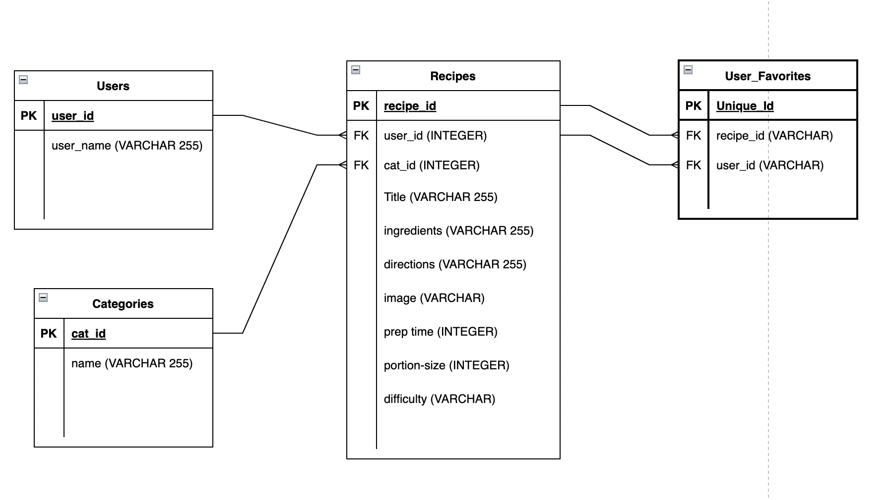

Tasty Eats 
=========

A web app that allows users to collaboratively create recipes which list out the needed ingredients and steps. 

Target audience: Home cooks 

It was build by Kelly Atmore, William Wijaya, Dominik Wrona 

## User Stories

User:
- As a user, I can search for a specific recipe. 

- As a user, I can access all the recipes. 

- As a user, I can create a new recipe. 

- I can view a list of all maps because I have a profile on the site

- As a user, I can NOT delete existing recipes

- As a user, I can NOT edit existing recipes 
 
- As a user when I create a new recipe I can add a title, ingredients, directions, image, prep time, portion size, difficulty

## Page Features 

- Regular users can see a list of the available maps;

- Regular users can view a map;

- A map can contain many points;

- Each point can have: a title, description, and image;

- Authenticated user can create maps;

- Authenticated user can modify maps (add, edit, remove points);

- Authenticated user can favourite a map;

- Authenticated user can see their indicated favourite maps and maps they've contributed to

## Setup
Install dependencies with `npm install`.

## Running Webpack Development
backend : in server directory, node index.js
frontend: in client directory, npm start

## Project Stack
__Front-End:__ React, Tailwind CSS
__Back-End:__ Express
__Database:__ Postgres

## Dependencies

- Axios
- Firebase
- Testing-library/jest-dom
- Testing-library/react
- Testing-library/user-event
- React
- React-dom
- React-router-dom
- Web-vitals
- Autoprefixer
- Postcss
- Tailwindcss
 
## ERD

## Finished App Screenshots

